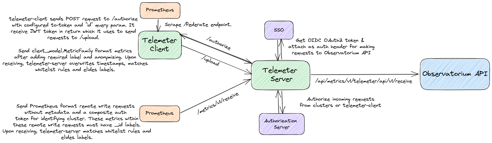

# Telemeter

Telemeter is a set of components used for [OpenShift remote health monitoring](https://docs.openshift.com/container-platform/latest/support/remote_health_monitoring/about-remote-health-monitoring.html). It allows OpenShift clusters to push telemetry data about clusters to Red Hat, as Prometheus metrics.



[telemeter-server](https://github.com/openshift/telemeter/tree/master/cmd/telemeter-server) needs to receive and send metrics across multiple security boundaries, and thus needs to perform several authentication, authorization and data integrity checks. It (currently) has two endpoints via which it receives metrics and forwards them to an upstream service as a [Prometheus remote write request](https://github.com/prometheus/prometheus/blob/release-2.38/prompb/remote.proto#L22).

## /upload endpoint (receive metrics in []client_model.MetricFamily format from telemeter-client, currently used by CMO)

Telemeter implements a Prometheus federation push client and server to allow isolated Prometheus instances that cannot be scraped from a central Prometheus to instead perform authorized push federation to a central location.

The [telemeter-client](https://github.com/openshift/telemeter/tree/master/cmd/telemeter-client) is deployed via the [OpenShift Cluster Monitoring Operator](https://github.com/openshift/cluster-monitoring-operator/blob/master/assets/telemeter-client/deployment.yaml) and performs a certain set of actions via a [`forwarder.Worker`](https://github.com/openshift/telemeter/blob/master/pkg/forwarder/forwarder.go) every 4 minutes and 30 seconds (by default).

1. On initialization, telemeter-client sends a `POST` request to the `/authorize` endpoint of telemeter-server with its configured token (configured via `--to-token/to-token-file`) as a auth header and the cluster ID as an `id` request query param (configured via `--id`). It exchanges the token for a JWT token from this endpoint and also receives a set of labels to include as well. Each client is uniquely identified by a cluster ID and all metrics federated are labelled with that ID. For more details on `/authorize` see [section](#authorize-for-telemeter-client).
2. It caches this token and labels in [`tokenStore`](https://github.com/openshift/telemeter/blob/master/pkg/authorize/token_store.go) and returns a [HTTP roundtripper](https://github.com/openshift/telemeter/blob/a30ef1e07eb12468cdcbdcf6fde45469a9fa5d60/pkg/forwarder/forwarder.go#L204). The [roundtripper](https://github.com/openshift/telemeter/blob/master/pkg/authorize/roundtripper.go) checks validity and of the cached token and refreshes it before attaching it to any request it sends to telemeter-server.
3. telemeter-client sends a `GET` request to the `/federate` endpoint of the in-cluster Prometheus instance, and scrapes all metrics (authenticates via `--from-ca-file` + `--from-token/from-token-file`). It retrieves the metrics from the response body and parses it into a [`[]*client_model.MetricFamily`](https://pkg.go.dev/github.com/prometheus/client_model/go#MetricFamily) type. You can even use `--match` arguments to match rules while federating.
4. telemeter-client performs some [transformations](https://github.com/openshift/telemeter/blob/master/pkg/metricfamily/multi_transformer.go) on these collected metrics, to anonymize them, rename them and to add labels provided by the roundtripper tokenStore and CLI args.
5. telemeter-client then encodes the metrics (of type `[]*client_model.MetricFamily`) into a `POST` request body and sends it to the `/upload` endpoint of telemeter-server, thereby "pushing" metrics. 

The telemeter-server upon receiving a request at the `/upload` endpoint, does the following,

1. It authorizes the request by inspecting the JWT token attached in the auth header, via the [`authorize.NewAuthorizeClientHandler`](https://github.com/openshift/telemeter/blob/a30ef1e07eb12468cdcbdcf6fde45469a9fa5d60/pkg/authorize/handler.go#L19) which uses [`jwt.clientAuthorizer`](https://github.com/openshift/telemeter/blob/master/pkg/authorize/jwt/client_authorizer.go) struct that implements the [`authorize.ClientAuthorizer`](https://github.com/openshift/telemeter/blob/master/pkg/authorize/client.go) interface, to uniqely identify the telemeter-client. 
2. If successfully identified, it passes [`authorize.Client`](https://github.com/openshift/telemeter/blob/a30ef1e07eb12468cdcbdcf6fde45469a9fa5d60/pkg/authorize/client.go#L11) into the request context, from which cluster ID is extracted later on via [`server.ClusterID`](https://github.com/openshift/telemeter/blob/a30ef1e07eb12468cdcbdcf6fde45469a9fa5d60/pkg/server/validator.go#L42) middleware.
3. It then checks if the cluster that the request came from, is under the configured request [rate limit](https://github.com/openshift/telemeter/blob/master/pkg/server/ratelimited.go).
4. If the request in under rate limits, telemeter-server [validates/transforms](https://github.com/openshift/telemeter/blob/master/pkg/server/validator.go) those metrics encoded in the request, by checking request body size, applying whitelist label matcher rules, elide labels (configured via `--whitelist` and `--elide-label`) and clusterID labels. It also overwrites all the timestamps that came with the metric families and records the drift, if any.
5. The server then converts the received metric families to [`[]prompb.TimeSeries`](https://github.com/prometheus/prometheus/blob/release-2.38/prompb/types.proto#L58). During conversion however it drops all the timestamps again and overwrites that with current timestamp. It then marshals that into a Prometheus remote write request and [forwards](https://github.com/openshift/telemeter/blob/master/pkg/server/forward.go) that to the Observatorium API, with an `oauth2.Client` (configured via OIDC flags) which attaches the correct auth header token after hitting SSO.

### /authorize (for telemeter-client)

telemeter-server implements an authorization endpoint for telemeter-client which does the following,

1. telemeter-server uses [`jwt.NewAuthorizeClusterHandler`](https://github.com/openshift/telemeter/blob/a284906562c101ae8d1b65ba029af0f54a7deead/pkg/authorize/jwt/handler.go#L32) which accepts `POST` requests, having a auth header token and a "id" query param.
2. This handler uses [`tollbooth.NewAuthorizer`](https://github.com/openshift/telemeter/blob/master/pkg/authorize/tollbooth/tollbooth.go) which implements the [`authorize.ClusterAuthorizer`](https://github.com/openshift/telemeter/blob/master/pkg/authorize/cluster.go) interface, to authorize that particular cluster. It uses [`authorize.AgainstEndpoint`](https://github.com/openshift/telemeter/blob/a30ef1e07eb12468cdcbdcf6fde45469a9fa5d60/pkg/authorize/handler.go#L65) to send the cluster ID and token as a POST request to the authorization server (configured via `--authorize`). The authorization server returns a 200 status code, if the cluster is identified correctly.
3. `tollbooth.AuthorizeCluster` returns a subject which is used as the client identifier in a generated signed JWT which is returned to the telemeter-client, along with any labels.

## /metrics/v1/receive endpoint (receive metrics in prompb.WriteRequest format from any client)

telemeter-server also supports receiving remote write requests directly from in-cluster Prometheus (or any Prometheus with the appropriate auth header). In this case, telemeter-client is no longer needed.

Any client sending a remote write request will need to attach a composite token as an auth header to the request, so that telemeter-server can identify which cluster that request belongs to. You can generate the token via the following,

```bash
CLUSTER_ID="$(oc get clusterversion -o jsonpath='{.items[].spec.clusterID}{"\n"}')" && \
AUTH="$(oc get secret pull-secret -n openshift-config --template='{{index .data ".dockerconfigjson" | base64decode}}' | jq '.auths."cloud.openshift.com"'.auth)" && \
echo -n "{'authorization_token':$AUTH,'cluster_id':$CLUSTER_ID}" | base64 -w 0
```
The client will also be responsible for ensuring that all metrics sent will have the `_id` (cluster ID) label. Sending metric metadata is not supported.

Upon receiving a request at this endpoint, telemeter-server does the following,

1. telemeter-server parses the bearer token (decodes base64 JSON with "cluster_id" and "authorization_token" fields) via [`authorize.NewHandler`](https://github.com/openshift/telemeter/blob/a30ef1e07eb12468cdcbdcf6fde45469a9fa5d60/pkg/authorize/handler.go#L122)
2. It then sends this as a `POST` request against the authorization server (configured via `--authorize`) using [`authorize.AgainstEndpoint`](https://github.com/openshift/telemeter/blob/a30ef1e07eb12468cdcbdcf6fde45469a9fa5d60/pkg/authorize/handler.go#L65). The authorization server returns a 200 status code, if the cluster is identified correctly.
3. telemeter-server then checks the [request body size](https://github.com/openshift/telemeter/blob/a30ef1e07eb12468cdcbdcf6fde45469a9fa5d60/pkg/receive/handler.go#L129) and if all metrics in the remote write request [have the cluster ID label](https://github.com/openshift/telemeter/blob/a30ef1e07eb12468cdcbdcf6fde45469a9fa5d60/pkg/receive/handler.go#L156) (`_id` by default). It also [drops metrics](https://github.com/openshift/telemeter/blob/a30ef1e07eb12468cdcbdcf6fde45469a9fa5d60/pkg/receive/handler.go#L217) which do not match whitelist label matchers and elides labels (configured via `--whitelist` and `--elide-label`).
4. It then [forwards](https://github.com/openshift/telemeter/blob/a30ef1e07eb12468cdcbdcf6fde45469a9fa5d60/pkg/receive/handler.go#L84) that to the Observatorium API, with an `oauth2.Client` (configured via OIDC flags) which attaches the correct auth header token after hitting SSO.

This is [planned](https://github.com/openshift/cluster-monitoring-operator/pull/1733) to be adopted by CMO.

**note: Telemeter is alpha and may change significantly**

## Get started

To see this in action, run

```
make test-integration
```

The command launches a two instance `telemeter-server` cluster and a single `telemeter-client` to talk to that server, along with a Prometheus instance running on http://localhost:9090 that shows the federated metrics.
The client will scrape metrics from the local Prometheus, then send those to the telemeter-server, which will then forward metrics to Thanos Receive, which can be queried via a Thanos Querier.

To build binaries, run

```bash
make build
```

To execute the unit test suite, run

```bash
make test-unit
```

## Adding new metrics to send via telemeter

Docs on the process on why and how to send these metrics are available [here](https://docs.google.com/document/d/1a6n5iBGM2QaIQRg9Lw4-Npj6QY9--Hpx3XYut-BrUSY/edit?usp=sharing).

## Testing recording rule changes

Run

```bash
make test-rules
```
