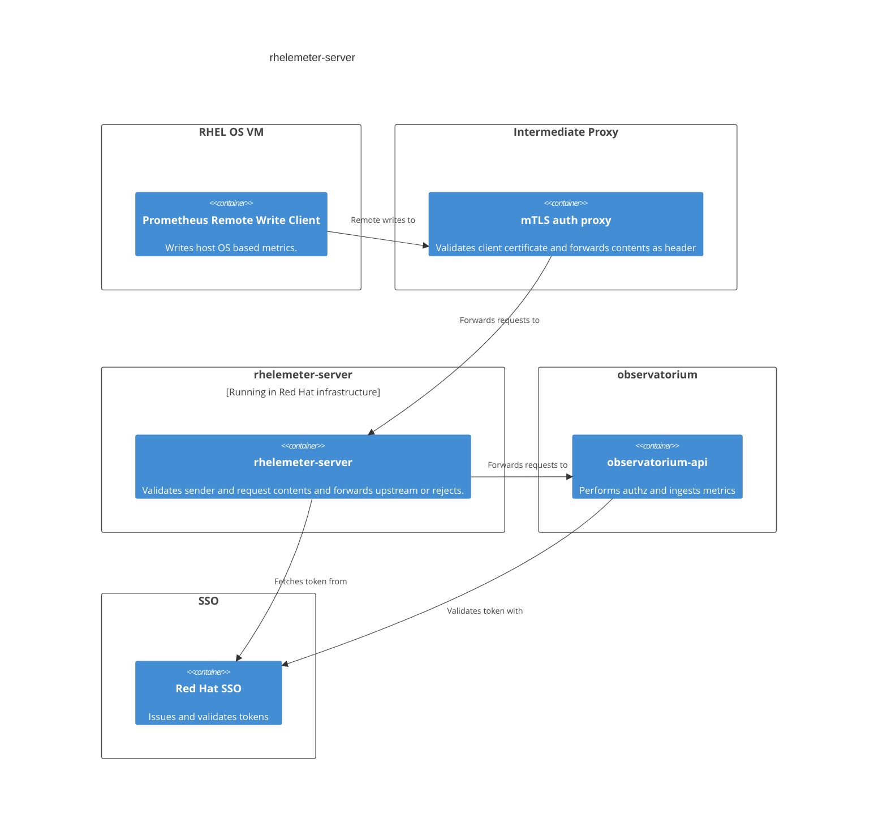

# Rhelemeter

Rhelemeter is a Prometheus remote write forward proxy. It allows RHEL hosts or an intermediate proxy to push metrics to
a upstream Prometheus (or Prometheus remote write compatible) endpoint.

[rhelemeter-server](https://github.com/openshift/telemeter/tree/master/cmd/rhelemeter-server) needs to receive
and send metrics across security boundaries, and thus performs additional authorization and data integrity checks as required.

Architecture


## Overview

The server on startup fetches a token from the configured authorization server and uses that to forward
requests to the upstream remote write endpoint. Tokens are refreshed automatically when they expire.

The server supports two modes of operation:

### Intermediate auth proxy
This is the flow described in the diagram above. The proxy is responsible for validating the client certificate and
forwarding the contents of the request as a headers. The server then validates the header using a pre-shared key
and forwards the request to the upstream as configured.

The `client-info-data-file` flag is used to specify the header names used to extract client info data.


Optionally, the `client-info-subject-label` flag can be used to specify a label name to store the client subject.
If present, the labels value on each time series much match the common name as forwarded by the proxy.
If set, the server expects the header to be present in the following format where `x-rh-certauth-cn` 
is configurable as described above:

```bash
x-rh-certauth-cn:  ${Certificate Subject}  
// Example  Certificate Subject ->  "/O = 1234567, /CN = 1234567-9b7c-48f6-8d5b-7654321```
```

### mTLS
The server is responsible for validating and decoding the client certificate and determining the client identity.

